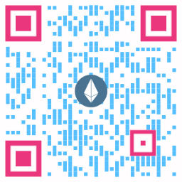
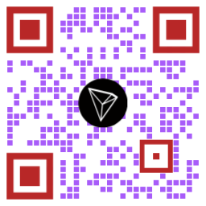
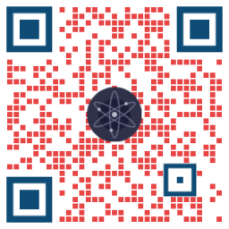

 
 

&nbsp;&nbsp;&nbsp;&nbsp;&nbsp;&nbsp;

 

---

<h3  align='center'>📬 Find me around the web 🌎 </h3>
 

&nbsp;&nbsp;&nbsp;&nbsp;
&nbsp;&nbsp;&nbsp;&nbsp;
&nbsp;&nbsp;&nbsp;&nbsp;
 
 
&nbsp;&nbsp;&nbsp;&nbsp;
&nbsp;&nbsp;&nbsp;&nbsp;

---

<h3 align="center">Languages and Tools I use</h3>

&nbsp;&nbsp;&nbsp;&nbsp;
&nbsp;&nbsp;&nbsp;&nbsp;
&nbsp;&nbsp;&nbsp;&nbsp;
&nbsp;&nbsp;&nbsp;&nbsp;
&nbsp;&nbsp;&nbsp;&nbsp;
&nbsp;&nbsp;&nbsp;&nbsp;
 
 
&nbsp;&nbsp;&nbsp;&nbsp;
&nbsp;&nbsp;&nbsp;&nbsp;
&nbsp;&nbsp;&nbsp;&nbsp;
 

---

<h3 align="center">💻 Workspace Specs</h3>

 
&nbsp;&nbsp;&nbsp;&nbsp;
&nbsp;&nbsp;&nbsp;&nbsp;
&nbsp;&nbsp;&nbsp;&nbsp;

 

---

<h3 align="center"> For Donations and Finance </h3>
&nbsp;&nbsp;&nbsp;&nbsp;&nbsp;&nbsp;&nbsp;&nbsp;&nbsp;&nbsp;&nbsp;

 
 
 

&nbsp;&nbsp;&nbsp;&nbsp;&nbsp;&nbsp;&nbsp;&nbsp;&nbsp;&nbsp;&nbsp;

 
 

 
&nbsp;&nbsp;&nbsp;&nbsp;
 
 
&nbsp;&nbsp;&nbsp;&nbsp;
 
 
&nbsp;&nbsp;&nbsp;&nbsp;
 
 
&nbsp;&nbsp;&nbsp;&nbsp;

---

<h3 align="center">Show some &nbsp;❤️&nbsp; by starring some of the repositories!</h3>

