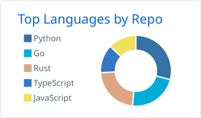
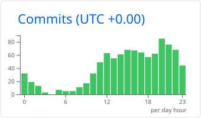

I build infrastructure for coding agents. Most of it comes back to one gap: an agent calls a tool, reads its own report of what happened, and carries on, so nothing outside the agent ever checks the result. [stoat](https://github.com/NovusEdge/stoat) gives the agent a disposable machine to act in, [midwire](https://github.com/NovusEdge/midwire) measures what actually changed, and [docket](https://github.com/NovusEdge/docket) keeps the decisions and their reasons so the next session starts from them.

### Agent infrastructure

- **[stoat](https://github.com/NovusEdge/stoat)**: local QEMU VMs for people and agents. Disposable Alpine sessions and persistent Linux guests from plain TOML, driven through a TUI, a JSON CLI or MCP tools. One Go binary.
- **[midwire](https://github.com/NovusEdge/midwire)**: closed-loop agency. Confirms that a tool call's side effect landed before the agent takes its next step.
- **[docket](https://github.com/NovusEdge/docket)**: an append-only decision ledger for coding agents. When a conversation resumes or gets compacted, it briefs the agent on what was decided, why, and what is still open.
- **[opencode-native-swarms](https://github.com/NovusEdge/opencode-native-swarms)**: permission-scoped background-agent workflows for OpenCode. It can research, review and run narrow checks, and has no path to edits, pushes or external writes.
- **[SkillOpt](https://github.com/NovusEdge/SkillOpt)**: trains reusable natural-language skills for frozen agents through trajectory-driven edits and validation-gated updates.
- **money-mesh** (private): a leaderless mesh of self-replicating earning agents under an immutable core. A Cedar policy engine sits at the enforcement point, revenue counts only from ground truth, and the spend cap is enforced by arithmetic.

### Claude Code plugins

- **[palpatine](https://github.com/NovusEdge/palpatine)**: a "strategic" advisor for Claude Code and Codex. It names the actual problem and the actions to take, in 50 words.
- **[curt](https://github.com/NovusEdge/curt)**: editing guidance and a heuristic prose linter that cuts AI slop and keeps the author's voice.
- **[readable-responses](https://github.com/NovusEdge/readable-responses)**: a readability hook and a de-slopify skill for Claude Code and Codex CLI, because Opus 5 yaps too much.
- **[polished-artifacts](https://github.com/NovusEdge/polished-artifacts)**: one design language for Claude artifacts, in Carbon and Apple looks, with a lint for rendered pages.

<b>Epistemic memory</b>

 

Memory that separates what an agent observed from what it concluded and what it made up.

- **[Engrammic](https://github.com/engrammic-ai/engrammic)**: epistemic memory as a graph of claims, evidence and provenance.
- **[Veil](https://github.com/engrammic-ai/veil)**: drop-in local-first agent memory with sqlite-vec embeddings, FSRS decay and deterministic eviction.
- **[LEAP/CITE](https://github.com/engrammic-ai/research)**: a layered epistemic protocol with stratified types and coherence enforced at write time.

<b>Other things</b>

 

- **ØCLOAK** (private): at-cost RF and WiFi-sensing hardware plus a peer-to-peer threat-intel network. Surveillance got cheap; defense didn't.
- **[Tapestry](https://github.com/NovusEdge/tapestry)**: sovereign frontier models. Nations train one shared model and own their derivatives.
- **[goob](https://github.com/NovusEdge/goob)**: a desktop pet that roams your screen.

### Open questions

- [x] Can an agent get a disposable machine as easily as a shell? *([stoat](https://github.com/NovusEdge/stoat))*
- [x] Can decisions outlive the session that made them? *([docket](https://github.com/NovusEdge/docket))*
- [x] Can skills be learned in text space, without touching weights? *([SkillOpt](https://github.com/NovusEdge/SkillOpt))*
- [x] Can stratified, warrant-backed memory run locally? *(LeAP, shipped as [Veil](https://github.com/engrammic-ai/veil))*
- [ ] Can an agent confirm its side effects before it continues? *([midwire](https://github.com/NovusEdge/midwire), in progress)*
- [ ] Generation got cheap and verification didn't. What closes that gap? *([essay](https://khimani.dev/blog/epistemic-collapse/))*
- [ ] Can autonomy be bounded by a policy engine and arithmetic, rather than by the prompt?
- [ ] What should a robot remember? Object states, failures and maps, retrieved under partial observability without surfacing stale entries.
- [ ] World action models: predicting the consequences of an action in latent space instead of rendering future frames.
- [ ] Closing the loop on hardware: a VLA policy that checks its action landed through sensors, not through its own prediction.
- [ ] Safety bounds a VLA policy cannot override: runtime envelopes enforced outside the model.
- [ ] Cross-embodiment transfer: data from one robot's kinematics and sensors that still teaches another.

### Stack

### Activity

<picture>
  <source media="(prefers-color-scheme: dark)" srcset="profile-summary-card-output/github_dark/1-repos-per-language.svg">
  
</picture>
<picture>
  <source media="(prefers-color-scheme: dark)" srcset="profile-summary-card-output/github_dark/4-productive-time.svg">
  
</picture>

### Elsewhere

[khimani.dev](https://khimani.dev) · [X](https://x.com/0kaliasgar) · [LinkedIn](https://www.linkedin.com/in/aliasgarkhimani/) · [khimanialiasgar@gmail.com](mailto:khimanialiasgar@gmail.com) · [Ko-fi](https://ko-fi.com/aliasgarkhimani)

